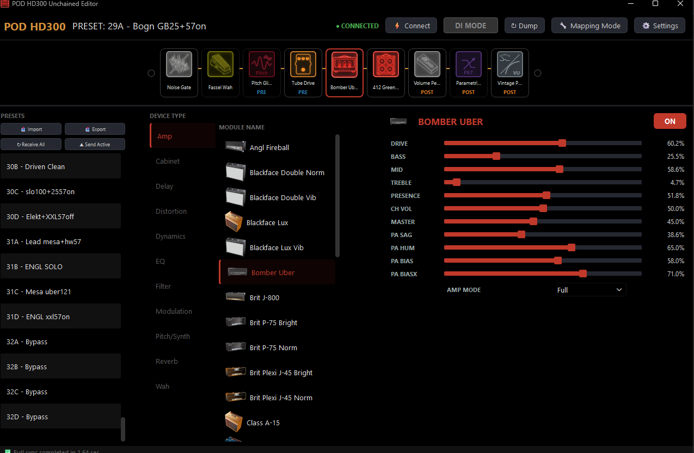

Readme · MD
# POD HD300 Unchained Editor
 

 
An alternative editor for the Line 6 POD HD300 guitar processor that removes the factory restrictions on effect slot routing.
 
## Background
 
The stock Line 6 firmware/editor hard-locks each FX slot to a fixed effect category: FX1 is limited to overdrive/distortion and compression, FX2 to modulation, and so on. This is a software-level restriction, not a hardware limitation — the HD300 DSP is capable of loading any effect type into any slot, similar to its larger sibling, the POD HD500.
 
This editor removes that restriction. Any effect type (Distortion, Delay, Modulation, Reverb, Pitch/Synth, Filter) can be assigned to any of the 4 available FX slots (FX1, FX2, FX3, REV). The hardware still has a hard limit of 4 simultaneous effect slots — that part can't be changed — but slot assignment is fully unlocked.
 
## Features
 
- **Unrestricted FX slot assignment** — load any effect category into any of the 4 FX slots.
- **Drag-and-drop signal chain editing** — reorder Amp, Cab, FX blocks, Wah, and Volume pedal freely. Assign blocks to PRE or POST position relative to the amp.
- **Full parameter access** — all Amp, Cab, Noise Gate, and Wah parameters are exposed; nothing is hidden.
- **Bidirectional MIDI sync (SysEx)** — parameter changes in the editor are sent to the device in real time. Changes made on the physical hardware are reflected in the UI.
- **Native `.h3e` preset support** — full read/write compatibility with the stock preset file format.
## Technology
 
Python 3, PyQt6 for the UI, `mido` and `python-rtmidi` for MIDI/SysEx communication with the hardware.
 
## Installation
 
1. Python 3.8 or later.
2. Clone this repository.
3. Install dependencies (a virtual environment is recommended):
```bash
   pip install -r requirements.txt
```
4. Connect the POD HD300 via USB and power it on.
5. Run:
```bash
   python main.py
```
 
## User Guide
 
### 1. Signal Chain and Drag-and-Drop
 
The signal chain is displayed across the top panel.
 
- **Block selection** — click any block (AMP, CAB, FX1–3, REV, WAH, VOL, GATE) to open its parameters in the right-hand panel.
- **Enable/disable** — the ON/OFF control in the top right toggles the selected block. Enabled blocks are shown in full color on the chain; disabled blocks are shown desaturated.
- **PRE/POST routing** — the PRE/POST control sets a block's position relative to the amp. PRE applies the effect before the amp stage; POST applies it after. Switching is applied immediately.
- **Drag-and-drop** — blocks can be reordered by dragging. The hardware re-applies the new chain order immediately.
- **Right-click** — bypasses (mutes) the block under the cursor. Right-click again to re-enable.
### 2. Settings (⚙)
 
- **Sync presets on startup** — fetches all 128 preset names from the device on connect. Only names are cached; if a preset is renamed on the hardware directly, the editor will show the stale name until a manual refresh.
- **Black Mode (AMOLED background)** — switches the UI to a dark theme.
- **Load Edit Buffer on startup**:
  - *Enabled (default)* — on connect, the editor loads the device's current live edit buffer, including unsaved knob changes made directly on the hardware.
  - *Disabled* — loads the saved preset from device memory instead, discarding any unsaved live state.
- **Experimental Free Routing (Drag-n-Drop)** — unlocks unrestricted reordering of FX1–3 and REV blocks. The HD300 hardware was not designed for this; reordering may introduce additional latency, and effect parameters may occasionally reset during the operation. Disable this if audio dropouts/clicks during reordering are not acceptable.
- **Unlock Mapping Mode** — exposes a mapping/calibration tool (🔧 icon) for adjusting SysEx parameter ranges and knob calibration. You *can* edit this. You probably shouldn't, unless a flaming ass sounds like a fun afternoon.
- **DI Mode Preset** — selects which of the 128 presets is used as the reference "clean" preset when DI Mode is activated.
### 3. DI Mode
 
For recording a dry guitar signal for reamping or live plugin processing.
 
- **Left-click** — saves the current preset reference and edit buffer, switches the device to the configured DI preset, and mutes direct USB monitoring on the device, leaving only the processed signal from the DAW audible.
- **Left-click again** — exits DI Mode, restores the original preset and edit buffer.
- **Right-click (failsafe)** — force-unmutes USB monitoring. Use this if the MIDI connection drops while DI Mode is active and audio monitoring needs to be restored manually.
### 4. Preset List and Controls
 
The left panel lists all 128 device presets. Double-click to load.
 
- **Import** — loads a `.h3e` or `.syx` preset file from disk into the current edit buffer. Audible immediately; not written to device memory until explicitly saved.
- **Export** — saves the current edit buffer to disk as `.h3e` or `.syx`.
- **Receive All** — re-fetches all 128 preset names from device memory. Useful if startup sync was disabled.
- **Send Active** — writes the current edit buffer (sound and name) to the active preset slot in device memory. This matches the save behavior of the stock editor and is the only action that persists changes to the hardware.
**Renaming presets**: right-click an active preset in the list to open an inline rename field (15 character limit). Press Enter to apply. The name change is local until **Send Active** is pressed to write it to device memory.
 
